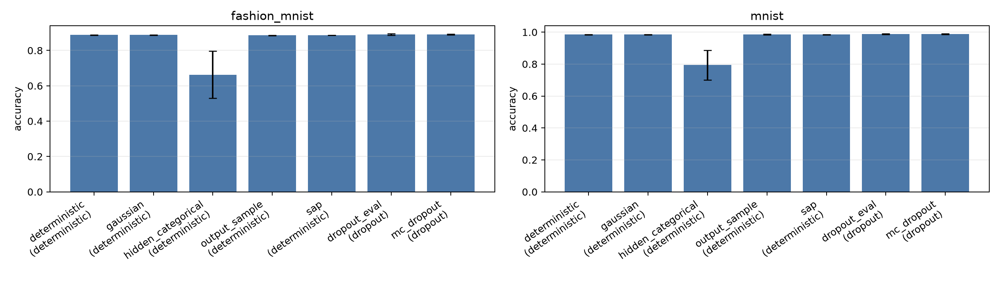
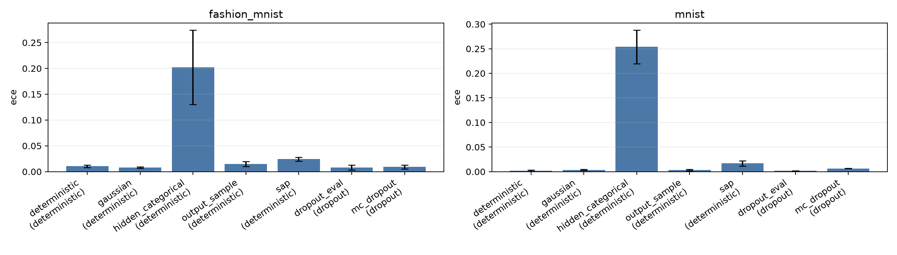
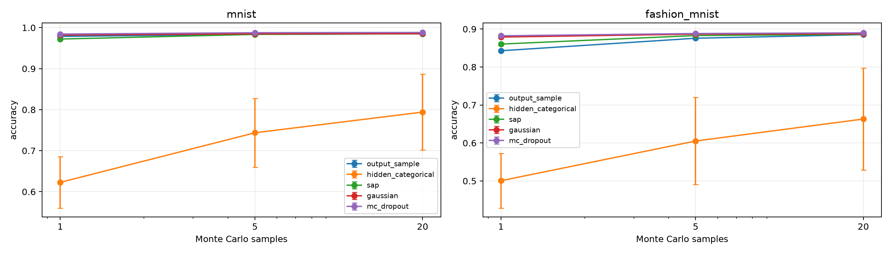
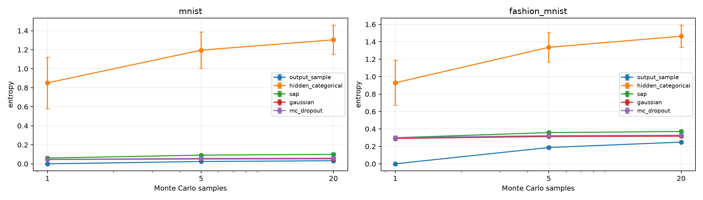
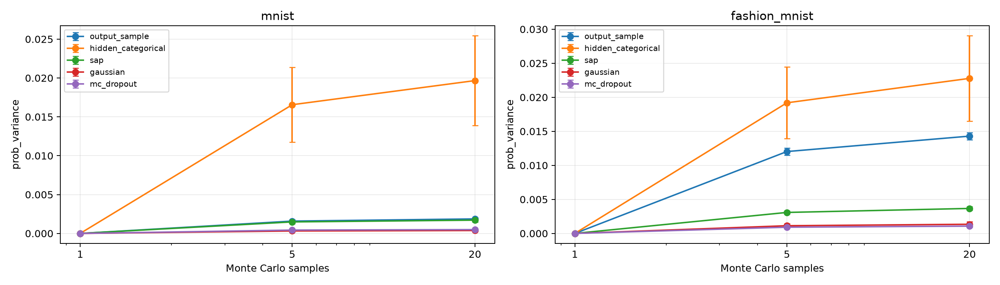

# Sampling Neural Network: Experimental Report

## 1. Executive Summary

This study tested whether sampling from an intermediate activation distribution changes neural-network behavior differently from deterministic inference or final-softmax sampling. The answer is yes: hidden-layer sampling produces distinct uncertainty and calibration behavior, but the naive "sample hidden units like a softmax" version is highly disruptive.

Across MNIST and Fashion-MNIST, SAP-style and Gaussian hidden sampling preserved accuracy almost exactly, while categorical hidden activation sampling reduced accuracy sharply even after 20 Monte Carlo samples. Final-softmax sampling preserved accuracy at 20 samples, but it degraded empirical NLL because the evaluated sampled distribution assigns coarse count-based probability mass. The practical implication is that hidden sampling is a real representational intervention, not just output sampling moved earlier; it needs a carefully designed distribution and training objective to be useful.

## 2. Research Question & Hypothesis

**Question:** What happens if an intermediate neural-network activation vector is treated as a distribution and sampled from, analogous to sampling from the final softmax layer?

**Hypothesis:** Sampling intermediate activations will alter network behavior in ways that differ from deterministic inference, final-softmax sampling, and common stochastic baselines.

The experiments intentionally do not claim that stochastic hidden activations are new. The novelty here is isolating the submitter's specific framing against output-only sampling, SAP-style activation sampling, Gaussian activation noise, and MC dropout in one controlled pipeline.

## 3. Literature Review Summary

The pre-gathered review identified several close lines of work:

- **Stochastic Activation Pruning (SAP; Dhillon et al., 2018):** samples activation indices with probability proportional to activation magnitude and rescales survivors.
- **Simple and Effective Stochastic Neural Networks (Yu et al., 2021):** models Gaussian activation uncertainty and evaluates robustness, pruning, and calibration.
- **Activation-level uncertainty (Morales-Alvarez et al., 2021):** shifts uncertainty from weights to activation functions.
- **Noisy activations, local reparameterization, MC dropout, VIB, and stochastic depth:** all inject stochasticity before the final prediction, but with different goals and distributions.

The gap from this review is that few experiments directly compare hidden activation sampling against final-softmax sampling as the isolated variable.

## 4. Data Construction

Datasets were loaded from local HuggingFace `save_to_disk` snapshots under `datasets/`.

| Dataset | Train | Validation | Test | Notes |
|---|---:|---:|---:|---|
| MNIST | 20,000 | 5,000 | 10,000 | Stratified subset from the original train split; official test set. |
| Fashion-MNIST | 20,000 | 5,000 | 10,000 | Balanced stratified subset; official test set. |

Normalization used only the training subset mean and standard deviation for each dataset and seed. Data metadata and class counts are saved in `results/data_metadata.csv`.

## 5. Methodology

I trained a compact CNN with two convolutional blocks and a 128-dimensional penultimate hidden layer. Two model variants were trained for each dataset and seed:

- `deterministic`: dropout probability 0.
- `dropout`: dropout probability 0.25 before the classifier head.

The tested inference methods were:

- `deterministic`: normal argmax inference.
- `output_sample`: sample labels from the final softmax and average one-hot samples.
- `hidden_categorical`: sample hidden dimensions from `softmax(abs(h) / tau)`, keep 25 percent draws, and rescale by inverse probability.
- `sap`: Bernoulli mask hidden dimensions with probability proportional to activation magnitude, target keep fraction 35 percent, and inverse-probability rescaling.
- `gaussian`: add activation noise proportional to per-example hidden standard deviation.
- `dropout_eval`: dropout-trained model with dropout disabled.
- `mc_dropout`: dropout-trained model with dropout active at inference.

Each stochastic method was evaluated with `S in {1, 5, 20}` Monte Carlo samples. Results below use `S=20` for stochastic methods unless otherwise noted.

**Hardware and software:** Python 3.12.8, PyTorch 2.12.0+cu130, CUDA 13.0, NumPy 2.4.6, pandas 3.0.3, scikit-learn 1.9.0, SciPy 1.17.1. Four NVIDIA RTX A6000 GPUs were visible; experiments used `cuda:0`. Batch size was 256, mixed precision was enabled, and total recorded GPU training time across 12 trained models was about 40 seconds.

**Reproducibility:** Seeds were 42, 123, and 456. Raw metrics are in `results/metrics_raw.csv`; summaries are in `results/metrics_summary.csv`; statistical tests are in `results/statistical_tests.csv`.

## 6. Results

### Primary Metrics

Accuracy is mean +/- standard deviation across three seeds. Other metrics are means.

| Dataset | Model | Method | S | Accuracy | NLL | ECE | Entropy | Prob. variance |
|---|---|---|---:|---:|---:|---:|---:|---:|
| Fashion-MNIST | deterministic | deterministic | 1 | 88.77 +/- 0.16 | 0.310 | 0.010 | 0.286 | 0.0000 |
| Fashion-MNIST | deterministic | gaussian | 20 | 88.75 +/- 0.16 | 0.310 | 0.008 | 0.317 | 0.0013 |
| Fashion-MNIST | deterministic | hidden_categorical | 20 | 66.30 +/- 13.40 | 1.032 | 0.202 | 1.464 | 0.0228 |
| Fashion-MNIST | deterministic | output_sample | 20 | 88.53 +/- 0.13 | 0.734 | 0.015 | 0.249 | 0.0143 |
| Fashion-MNIST | deterministic | sap | 20 | 88.61 +/- 0.03 | 0.320 | 0.024 | 0.371 | 0.0037 |
| Fashion-MNIST | dropout | dropout_eval | 1 | 89.06 +/- 0.36 | 0.305 | 0.008 | 0.282 | 0.0000 |
| Fashion-MNIST | dropout | mc_dropout | 20 | 89.00 +/- 0.25 | 0.307 | 0.009 | 0.328 | 0.0011 |
| MNIST | deterministic | deterministic | 1 | 98.55 +/- 0.12 | 0.044 | 0.002 | 0.040 | 0.0000 |
| MNIST | deterministic | gaussian | 20 | 98.53 +/- 0.12 | 0.044 | 0.003 | 0.053 | 0.0004 |
| MNIST | deterministic | hidden_categorical | 20 | 79.41 +/- 9.27 | 0.833 | 0.254 | 1.304 | 0.0197 |
| MNIST | deterministic | output_sample | 20 | 98.51 +/- 0.18 | 0.112 | 0.003 | 0.032 | 0.0019 |
| MNIST | deterministic | sap | 20 | 98.51 +/- 0.12 | 0.055 | 0.017 | 0.100 | 0.0017 |
| MNIST | dropout | dropout_eval | 1 | 98.81 +/- 0.13 | 0.036 | 0.002 | 0.035 | 0.0000 |
| MNIST | dropout | mc_dropout | 20 | 98.82 +/- 0.14 | 0.038 | 0.006 | 0.059 | 0.0005 |

### Sample Count Effects

Monte Carlo averaging helped stochastic methods, but it did not make hidden categorical sampling benign. For MNIST, categorical hidden sampling improved from 62.28 percent accuracy at `S=1` to 79.41 percent at `S=20`, still far below deterministic 98.55 percent. On Fashion-MNIST it improved from 50.06 percent to 66.30 percent, still far below deterministic 88.77 percent.

SAP and Gaussian noise behaved differently. On MNIST, SAP rose from 97.22 percent at `S=1` to 98.51 percent at `S=20`, and Gaussian rose from 98.20 percent to 98.53 percent. On Fashion-MNIST, SAP rose from 86.04 percent to 88.61 percent, and Gaussian rose from 87.89 percent to 88.75 percent.

### Statistical Tests

Paired tests compare each deterministic-model stochastic method at `S=20` to deterministic inference across the three seeds. With only three seeds, p-values are descriptive and effect sizes are more informative.

Key paired differences:

- Hidden categorical accuracy dropped by 19.13 percentage points on MNIST and 22.46 points on Fashion-MNIST. Holm-corrected p-values were not below 0.05 because `n=3` and variance was large, but paired effect sizes were large (`dz=-2.07` and `dz=-1.66`).
- Hidden categorical ECE increased strongly: +0.252 on MNIST (`p_holm=0.026`, `dz=7.11`) and +0.192 on Fashion-MNIST (`p_holm=0.168`, `dz=2.73`).
- Hidden categorical predictive entropy increased by +1.265 on MNIST (`p_holm=0.015`, `dz=8.06`) and +1.178 on Fashion-MNIST (`p_holm=0.011`, `dz=9.55`).
- SAP preserved accuracy within 0.04 percentage points on MNIST and 0.15 points on Fashion-MNIST, but increased entropy on both datasets.
- Final-softmax sampling at `S=20` preserved accuracy, but increased NLL by +0.069 on MNIST and +0.424 on Fashion-MNIST under the empirical sampled-probability evaluation.

## 7. Analysis & Discussion

The hypothesis is supported in the behavioral sense: sampling intermediate activations is not equivalent to sampling from the final softmax. Hidden categorical sampling perturbs the representation before the classifier head, and this changes errors, calibration, entropy, and probability variance in ways output sampling does not.

The strongest finding is also a caution. The direct "softmax over hidden activations, sample dimensions, rescale" version is too destructive for a normally trained deterministic CNN. Even expectation-preserving rescaling and 20-sample averaging did not recover deterministic accuracy. This suggests that hidden categorical sampling needs sample-aware training, a better distribution, structured groups/channels instead of individual hidden dimensions, or a learned stochastic bottleneck.

SAP and Gaussian hidden sampling were much less destructive. They show that intermediate stochasticity can be inserted post hoc without destroying accuracy, but their main effect here was to increase entropy and predictive variance rather than improve accuracy or calibration. MC dropout behaved similarly on the dropout-trained model.

Final-softmax sampling behaved differently again. Accuracy recovered with enough samples because the underlying class probabilities remained unchanged, but empirical sampled probabilities were coarse, which hurt NLL. This reinforces that output sampling is a readout-level stochastic operation, while hidden sampling changes the computation itself.

## 8. Limitations

- Only MNIST and Fashion-MNIST were used. CIFAR-10 and CIFAR-100 were available locally but deferred to keep the automated execution bounded.
- The architecture was intentionally small. Results may differ for ResNets, transformers, or models trained with stochastic hidden sampling from the start.
- Hidden categorical sampling was applied to the penultimate vector only. Sampling channels or spatial maps might behave differently.
- Statistical power is limited to three seeds, so p-values should not be overinterpreted.
- Robustness attacks were not run. The literature warns that stochastic defenses require expectation-over-transformation attacks, which should be a separate controlled experiment.
- NLL for `output_sample` evaluates empirical sampled probabilities, not the original analytic softmax distribution. This is intentional for sampled-behavior comparison but should not be read as the model's native probabilistic quality.

## 9. Conclusions & Next Steps

Sampling intermediate activations changes network behavior in novel ways compared with deterministic inference and final-softmax sampling. The naive categorical hidden sampler mainly damages learned representations, while SAP-style and Gaussian hidden sampling preserve accuracy and alter uncertainty.

The next most useful experiment is sample-aware training: train the network with the exact hidden sampling mechanism active, then compare post-hoc sampling against trained-for-sampling inference. After that, test channel-level SAP/categorical sampling on CIFAR-10 with robustness and calibration metrics.

## 10. Output Files

- `planning.md`: preregistered motivation, novelty, and analysis plan.
- `src/sampling_nn_experiment.py`: full training, inference, analysis, and plotting pipeline.
- `results/metrics_raw.csv`: all seed-level metric rows.
- `results/metrics_summary.csv`: mean/std/CI summary by method.
- `results/statistical_tests.csv`: paired tests, confidence intervals, effect sizes, and Holm correction.
- `results/data_metadata.csv`: split sizes, normalization statistics, and class counts.
- `results/environment.json`: software, hardware, and config metadata.
- `figures/*.png`: training, accuracy, calibration, entropy, and variance plots.

## References

- Dhillon et al. (2018), *Stochastic Activation Pruning for Robust Adversarial Defense*, local file `papers/2018_dhillon_stochastic_activation_pruning.pdf`.
- Yu et al. (2021), *Simple and Effective Stochastic Neural Networks*, local file `papers/2021_yu_simple_effective_stochastic_neural_networks.pdf`.
- Morales-Alvarez et al. (2021), *Activation-level uncertainty in deep neural networks*, local file `papers/2021_morales_activation_level_uncertainty.pdf`.
- Gal and Ghahramani (2016), *Dropout as a Bayesian Approximation*, local file `papers/2016_gal_dropout_bayesian_approximation.pdf`.
- Kingma, Salimans, and Welling (2015), *Variational Dropout and the Local Reparameterization Trick*, local file `papers/2015_kingma_variational_dropout_local_reparam.pdf`.
- Jang et al. (2017), *Categorical Reparameterization with Gumbel-Softmax*, local file `papers/2017_jang_gumbel_softmax.pdf`.
